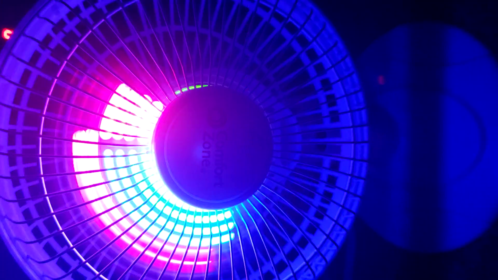
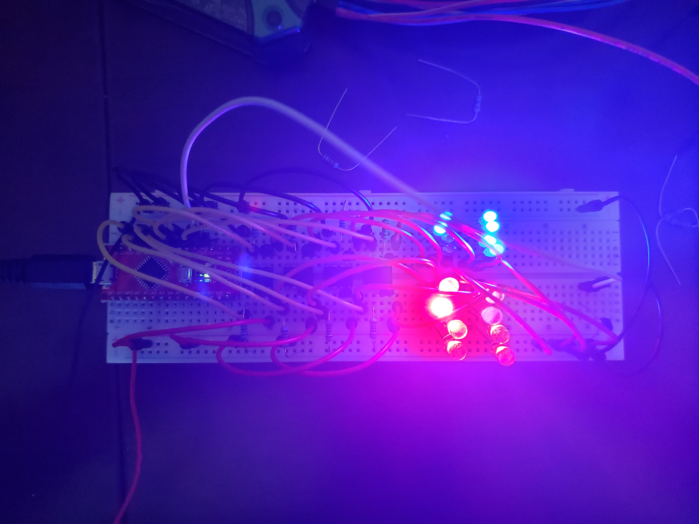
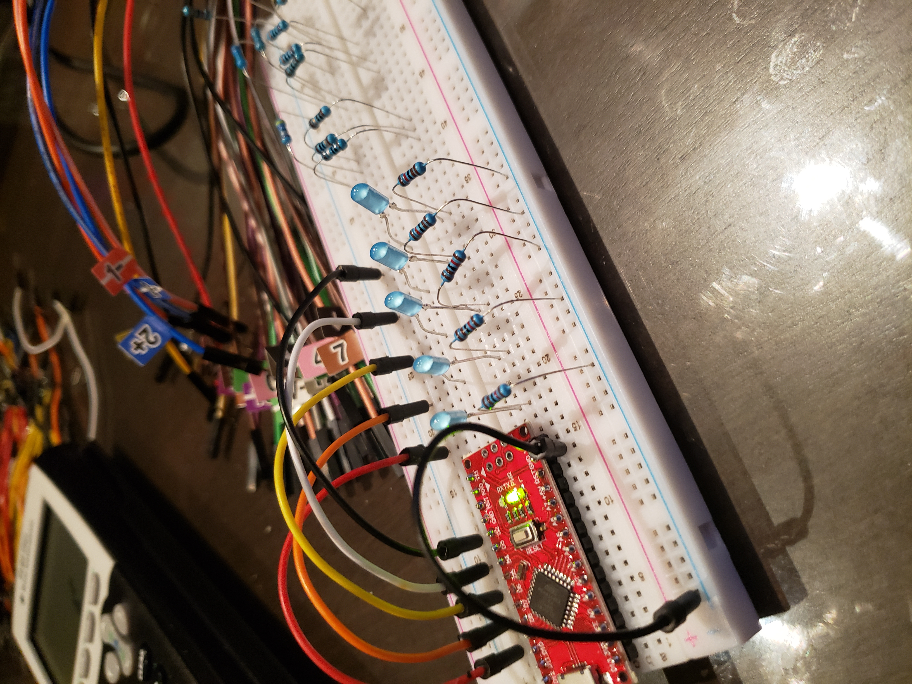
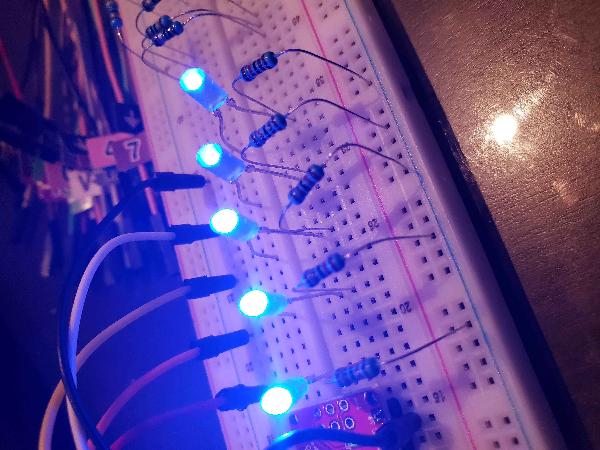
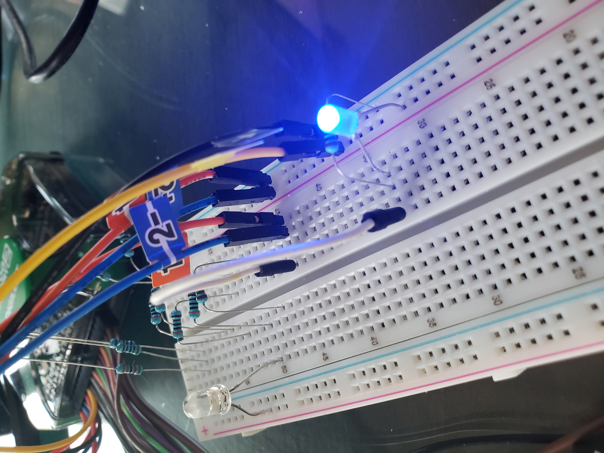
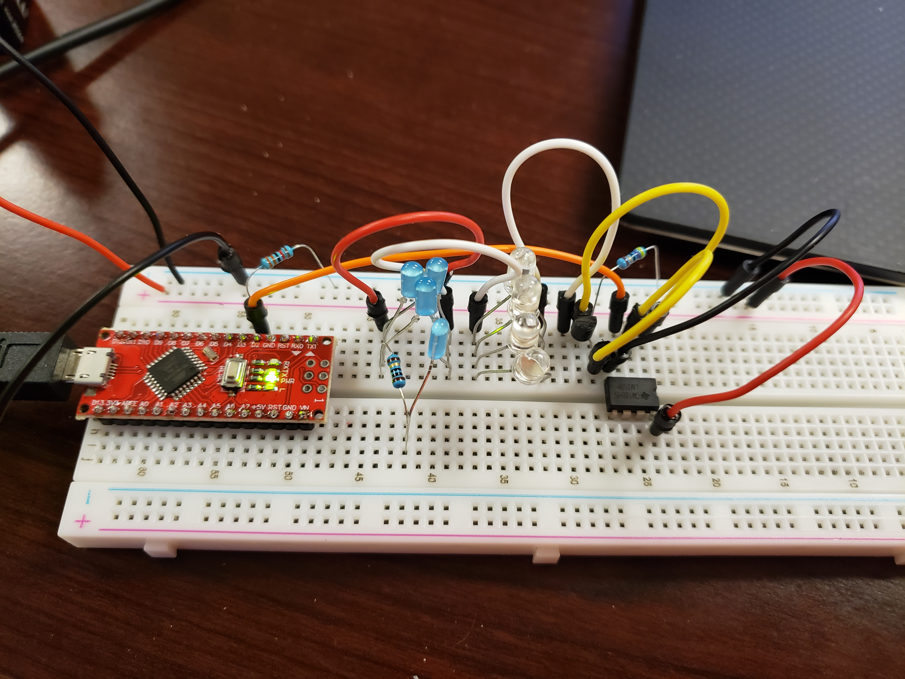

# Project Title
A custom, fan-mounted circuit designed to pulse rotating lights by detecting a magnet mounted to the rim of the fan.

## Overview
This project was the culmination of my introductory circuits class while in college. The goal was to design an LED-driving, battery-operated circuit using Op-Amps and controlled via an Arduino. Control input was to come from a hall-effect sensor detecting the presence or absence of a magnetic field. While many of these parts were provided as a kit, freedom was given to design and program the circuit. It was a lot of fun putting it together and working out the bugs in both hardware and software. Once the circuit was assembled, I was able to mount it on the fan and enjoyed watching the patterns created by the pulsed lights. Overall, it was a challenging project that involved circuit design and manufacture, software development, and troubleshooting--A small showcase of the engineering design methodology.

## Key Technologies

| Programming Language | Hardware                                                         |
| -------------------- | ---------------------------------------------------------------- |
| - C/C++ (Arduino)    | - LEDs   -Op-Amps   - Arduino   - Hall-Effect Sensor |

## Features / Capabilities
- Separately driven red and blue LEDs
- 4 separate lighting zones
- Hand-soldered circuit board
- Custom 3D printed sensor holder

## What I Learned
- I learned to create a project from start to finish while practicing various stages of engineering design:
	- circuit design
	- prototyping
	- manufacturing
	- programming
	- debugging
	- iterating

## Media

[Go to All Media](./media)